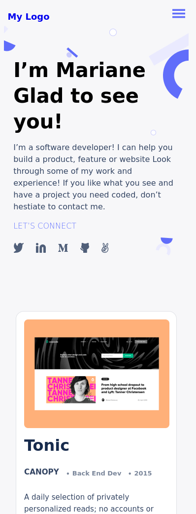

# portfolio

this is my portfolio website shows information about my professional skills and projects i have worked on

## Built With 
 - HTML
 - CSS

## Getting started

to run the project locally, clone the project using the command 

`git clone https://github.com/banlon-jones/portfolio.git`

### Run test
navigate in to the project directory, from GitHub,
to test or run the application double click on the `index.html` file to open in your browser

## Authors

### Author1
 - Github: [banlon-jones](https://github.com/banlon-jones)
 - LinkedIn: [banlon jones](https://www.linkedin.com/in/banlon-jones-b0205812a)
 - Twitter: [@banlonjones](https://twitter.com/banlonjones)

## Acknowledgments

- inspiration